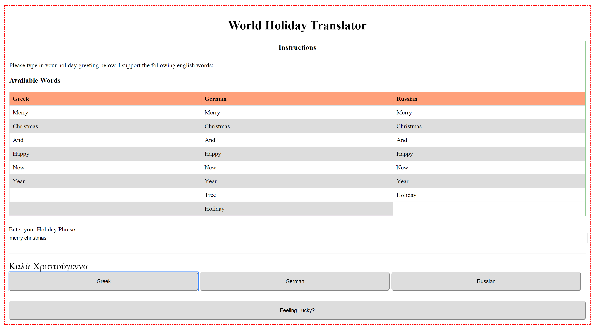

# Translator

We were tasked to build a an app using javascript objects that will translate user input text fomr English into at least three other languages.

## Requirements

Your translator should work for 3 languages other than English, so you should have 3 different dictionary objects.
Your project should have one HTML file that includes a textarea (for users to enter limited phrases with words contained in your dictionaries), 3 buttons that have the language to translate to, and an empty DOM element into which the translated text will be inserted.
The user types something in, clicks the button they want to translate to, and that translated statement should appear in the empty DOM element.

## Style Requirements

Your JS file should be comprised of functions, no actions should happen in your code outside of a function
Your HTML and JS should all have proper indentations

## Screenshots



## How to run this project

- Use npm to install http-server in your terminal:

```sh
npm install -g http-server
```

- Run the server

```sh
hs -p 8080
```

- Open your browser and navigate to:

```
localhost:8080
```
